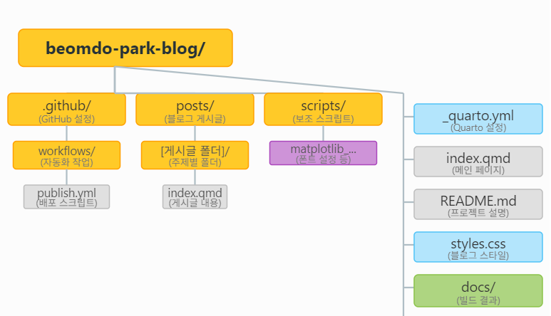
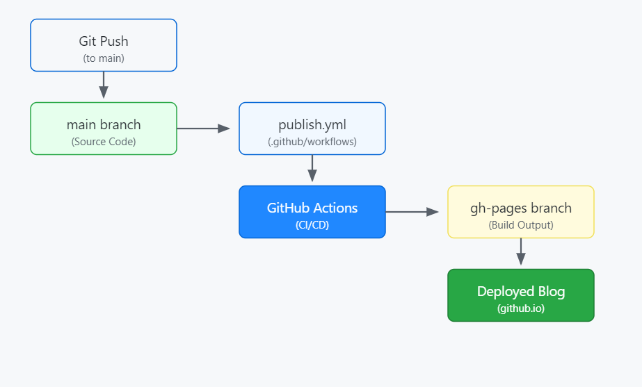

# beomdo's ML-DL blog

데이터 분석, 머신러닝, 프로그래밍 관련 학습 내용을 기록하고 공유합니다.

[➡️ **블로그 바로가기**](https://beomdo-park.github.io)

## ✨ 기술 스택

---

<table width="100%">
  <tr>
    <td align="center" width="49%"> <b>레포지토리 구조</b></td>
    <td align="center" width="49%"> <b>배포 과정</b></td>
  </tr>
</table>

### 레포지토리 구조와 배포 과정
1.  **변경사항 발생 및 푸시**: 로컬에서 블로그 게시물(`posts/`)을 작성하거나, 스타일(`styles.css`), 또는 블로그 설정(`_quarto.yml`, `index.qmd`)을 수정한 후, 변경 사항을 `main` 브랜치로 `Git Push`.
2.  **워크플로우 실행**: 이 푸시는 `.github/workflows/` 폴더 내의 `publish.yml` 파일에 정의된 GitHub Actions 워크플로우를 자동으로 트리거.
3.  **빌드**: GitHub Actions는 `main` 브랜치의 최신 코드를 가져와 Quarto 프로젝트를 빌드. 이 과정에서 `_quarto.yml`이 프로젝트 전체 설정을 담당하고, `posts/`의 `.qmd` 파일들이 개별 게시물로 변환. `scripts/` 내의 코드가 빌드 과정에 matplot 폰트, 양식 설정.
4.  **결과물 생성 및 배포**: 빌드가 완료되면, 생성된 웹사이트 파일들은 `docs/` 폴더에 해당하는 내용으로 구성. `publish.yml` 워크플로우는 이 결과물을 `gh-pages` 브랜치로 푸시.
5.  **블로그 게시**: GitHub Pages는 `gh-pages` 브랜치의 내용을 자동으로 감지하여 `https://beomdo-park.github.io` 주소로 블로그를 웹에 게시.
