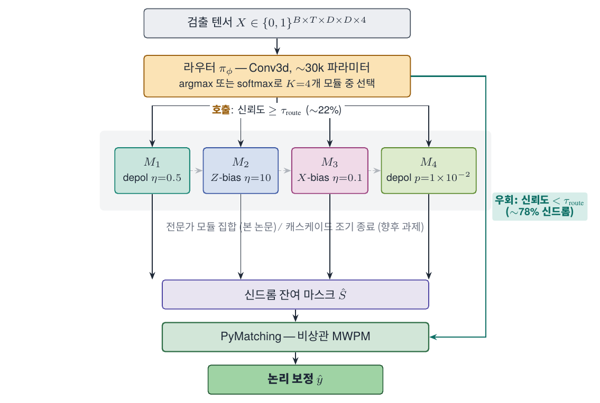
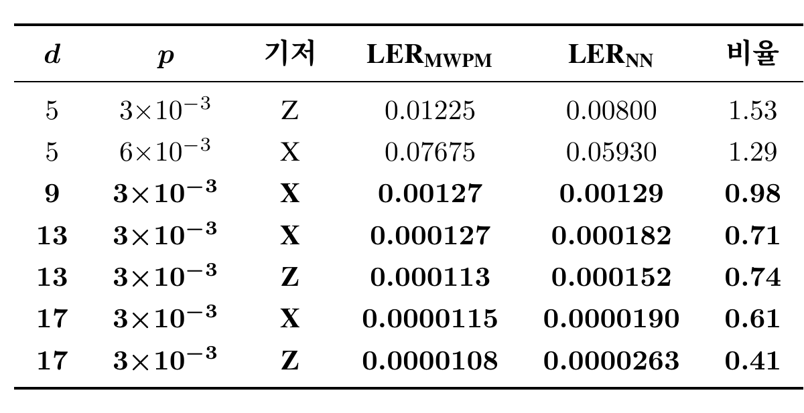
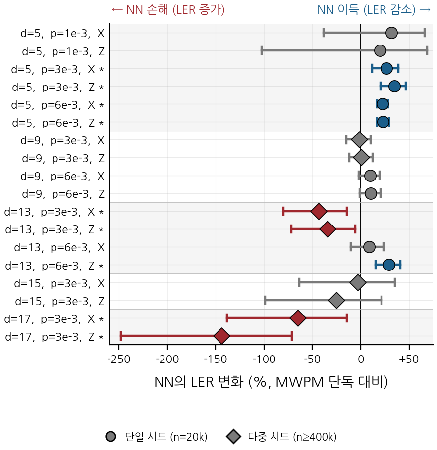

> 안녕하세요, ABC 프로젝트 멘토링 2기 ROQET 팀 다섯 번째 기술노트입니다. 4주차까지는 GNN 디코더가 MWPM과의 격차를 얼마나 좁히는지를 측정했습니다. 이번 주는 결이 다른 질문 — *NVIDIA가 공개한 신경망 사전 디코더는 모든 신드롬에서 정말 도움이 되는가* — 를 18개 조건에서 직접 검증합니다. 전자공학회 하계 2026에 제출 준비 중인 논문 *AI 사전 디코더의 긍정 기여 희소성 측정과 선택적 호출 게이트* 의 측정 부분을 옮겨 정리했습니다.

::: {.callout-tip title="이전 포스트"}
- [1주차 포스트](/posts/project-roqet-01-gnn-quantization/) — GNN과 PTQ 개념 정리
- [2주차 포스트](/posts/project-roqet-02-qec-stim-stabilizer/) — QEC 기본 동작과 Stim으로 신드롬 데이터 생성
- [3주차 포스트](/posts/project-roqet-03-detector-graph-gnn/) — Annotated Detector Graph와 GNN 디코더 첫 학습
- [4주차 포스트](/posts/project-roqet-04-edge-aware-decoder/) — 엣지 타입 분리 디코더와 MWPM 격차 측정
:::

NVIDIA가 작년에 공개한 Ising-Decoding (Fast)는 모든 신드롬에 동일한 신경망 보정을 한 번씩 적용합니다. 한 번 호출에 약 4 µs, 파라미터는 91만 개입니다. 운용은 *신경망 보정이 매 신드롬에서 평균적으로 이득* 이라는 가정 위에 서 있는데, 이 가정 자체가 직접 검증된 사례는 드뭅니다. 본 포스트에서는 18개 조건에서 그 가정을 측정해서 검증합니다.

---

## 1. NVIDIA Ising-Decoding과 균일 호출 가정

표면 부호 양자 오류 정정에서 *사전 디코더(pre-decoder)* 는 신드롬을 보고 잔여 마스크를 한 번 보정한 뒤, 그 결과를 후단의 MWPM 디코더가 받아 최종 처리하는 2단 구조입니다. 신경망이 잘 잡는 패턴은 신경망에 맡기고, 매칭 디코더는 그 위에서 마무리만 한다는 직관입니다.

NVIDIA의 Ising-Decoding (Fast)가 이 구조의 대표 사례입니다. NVIDIA GB300에서 종단 지연시간을 마이크로초 수준으로 끌어내려 결맞음 한계 안쪽 운용을 시연했고, 신경망과 매칭 디코더의 결합이 실제 하드웨어에서 동작함을 보였습니다. 다만 운용 정책은 단순합니다. 모든 신드롬에 대해 신경망을 한 번씩 호출합니다. 즉 *균일 호출* 가정에 의존합니다.

가정의 첫 균열은 NVIDIA 본인의 논문 안에 이미 노출돼 있습니다. 거리 13/물리 오류율 $3{\times}10^{-3}$ 동작점에서 Ising-Decoding (Fast)가 PyMatching 단독 대비 0.91배 속도로 보고됩니다. 신경망을 거치고 매칭까지 하는 비용이 매칭 단독 비용을 넘는다는 의미이고, 어떤 영역에서는 균일 호출이 손해라는 신호가 같은 문헌에 함께 적혀 있는 셈입니다.

본 포스트는 다음 세 질문에 답합니다.

1. 신경망 호출이 *진짜 도움이 되는* 비율은 거리/물리 오류율에 따라 어떻게 분포하는가.
2. 도움이 되지 않는 영역, 더 나아가 *오히려 해가 되는* 영역이 통계적으로 존재하는가.
3. 그 영역은 단순 if-else 규칙으로 분리 가능한가, 아니면 학습된 분류기가 필요한가.

---

## 2. 사전 디코더 파이프라인

본문에 들어가기 전에 파이프라인 그림 한 장으로 용어를 맞추겠습니다.

{#fig-arch width=85%}

거리 $d$의 회전 표면 부호 메모리 실험을 $T$ 라운드 돌리면, 검출기 텐서 $X \in \{0,1\}^{T \times d \times d \times 4}$와 논리 관측치 $\ell \in \{0,1\}$이 얻어집니다. 두 파이프라인은 다음과 같이 정의됩니다.

$$
\hat{\ell}_{\mathrm{NN}}(X) = \mathrm{MWPM}\!\bigl(X \oplus \mathrm{round}(f_\theta(X))\bigr), \quad
\hat{\ell}_{\mathrm{MWPM}}(X) = \mathrm{MWPM}(X).
$$

$f_\theta$가 NVIDIA의 학습된 사전 디코더입니다. 본 회차의 핵심 질문은 *주어진 한 샷에 대해 위 두 파이프라인 중 어느 쪽을 호출할 것인가* 이며, 균일 호출 가정은 모든 샷에서 첫 번째를 골라도 평균적으로 손해가 없다는 명제에 해당합니다.

---

## 3. 긍정 기여와 부정 기여 라벨

가정 위배를 측정하려면 *한 샷이 신경망 보정으로부터 얻은 이득* 을 라벨로 정의해야 합니다. 두 파이프라인을 같은 신드롬에 모두 적용하고, 결과 조합을 다음과 같이 분류합니다.

| MWPM 단독 | NN+MWPM | 라벨 |
|-----------|---------|------|
| 정답 | 정답 | 무관 |
| 오답 | 정답 | **긍정 기여** (NN이 도움) |
| 정답 | 오답 | **부정 기여** (NN이 해함) |
| 오답 | 오답 | 무관 |

수식으로는 다음과 같습니다.

$$
y_{\mathrm{help}}(X, \ell) = \mathbb{1}\!\left[\hat{\ell}_{\mathrm{NN}}(X) = \ell \;\wedge\; \hat{\ell}_{\mathrm{MWPM}}(X) \neq \ell\right],
$$
$$
y_{\mathrm{hurt}}(X, \ell) = \mathbb{1}\!\left[\hat{\ell}_{\mathrm{NN}}(X) \neq \ell \;\wedge\; \hat{\ell}_{\mathrm{MWPM}}(X) = \ell\right].
$$

긍정 기여율 $\mathbb{E}[y_{\mathrm{help}}]$에서 부정 기여율을 뺀 값이 *MWPM 단독을 신경망 파이프라인으로 대체할 때 한 샷이 얻는 기대 이득* 이고, 균일 호출 가정은 이 차이가 모든 영역에서 양수임을 요구합니다. 본 측정은 이 차이가 거리와 물리 오류율에 따라 음수로 뒤집히는 영역이 실제로 존재함을 다중 시드 통계로 확인합니다.

---

## 4. 실험 설계 — 18개 조건과 McNemar 검정

조건 셋업은 다음과 같이 잡았습니다.

- 거리 $d \in \{5, 9, 13\}$
- 물리 오류율 $p \in \{10^{-3},\, 3{\times}10^{-3},\, 6{\times}10^{-3}\}$
- 측정 기저 $\{X, Z\}$
- 분포 외 일반화 검증용으로 거리 15, 17 추가

거리 × 물리 오류율 × 기저 = 18개 조건이고, 거리 15/17은 학습 분포에 포함되지 않은 *분포 외* 조건입니다.

회로는 안정자 시뮬레이터 Stim으로 생성하고, NVIDIA가 공개한 25-파라미터 SI1000 잡음 모델을 단일 물리 오류율 입력으로 호출하여 NVIDIA 학습 조건과 동일하게 맞췄습니다. 후단 매칭은 PyMatching의 비상관 가중치 매칭, 신경망은 NVIDIA 공개 가중치(91만 2,772 파라미터)를 그대로 사용했습니다. 모든 디코더는 RTX 5090(32 GB) GPU 한 장에서 FP16 정밀도로 실행했습니다.

기본 표본 크기는 조건당 2만 샷이지만, 거리가 커질수록 LER이 빠르게 떨어져 단일 시드 측정의 분해능이 부족해집니다. 거리 9와 13의 일부 조건은 20개 시드로 묶어 100만 샷, 거리 17은 400만 샷까지 늘렸습니다. 학습과 평가의 Stim 시드는 분리했습니다.

::: {.callout-note title="McNemar 페어드 검정"}
같은 신드롬 $X$에 두 파이프라인을 모두 적용한 *페어드* 데이터이며, 각 결과는 정답/오답의 이진값입니다. 이런 paired binary 데이터에서는 일반 t-검정이 독립 샘플 가정을 어기므로 부적절하고, McNemar 검정이 표준입니다. 검정은 *신경망만 맞춘 횟수* 와 *MWPM만 맞춘 횟수* 의 비대칭이 우연 수준인지 본 뒤, $p < 0.01$이면 두 파이프라인 정확도 차이가 우연일 확률 1% 미만으로 해석합니다. 본 회차의 손해 영역 주장은 모두 이 검정을 통과시킨 결과만 보고합니다.
:::

---

## 5. 결과 1 — 대표 조건의 LER 비율 표

대표 7개 조건의 LER 비율 표를 먼저 봅니다. 비율 칸은 $\mathrm{LER}_{\mathrm{MWPM}}/\mathrm{LER}_{\mathrm{NN}}$로, 1보다 크면 신경망이 도움, 1보다 작으면 신경망이 손해입니다.

{#fig-table width=90%}

세 가지 패턴이 두드러집니다.

- **거리 5에서는 신경망이 분명히 도움.** 거리 5/$p=3{\times}10^{-3}$/$Z$ 기저에서 LER이 1.225%에서 0.800%로 떨어져 비율 1.53, 거리 5/$p=6{\times}10^{-3}$/$X$ 기저에서도 7.675%에서 5.930%로 비율 1.29. 균일 호출이 의도대로 동작하는 영역입니다.
- **거리 9는 무이득.** $p=3{\times}10^{-3}$/$X$ 기저에서 LER이 0.127%에서 0.129%로 비율 0.98. 100만 샷에서 McNemar $p > 0.8$이므로 1.0과 통계적으로 구별되지 않습니다. 그런데도 신경망 호출은 한 샷당 4 µs를 그대로 지불합니다.
- **거리 13에서 부호가 뒤집힘.** $p=3{\times}10^{-3}$ 조건에서 비율이 $X$ 기저 0.71, $Z$ 기저 0.74까지 떨어집니다. 0.000127 → 0.000182 ($X$), 0.000113 → 0.000152 ($Z$). 신경망 호출이 LER을 30% 가까이 증가시키며, McNemar 검정에서 $p < 10^{-2}$로 유의합니다. 분포 외 거리 17에서는 비율이 0.61/0.41까지 깊어져 LER이 거의 두 배가 됩니다.

동일한 신경망 가중치가 거리 5에서는 분명한 이득을, 거리 13에서는 통계적으로 검증된 손해를 만든다는 사실은 호출 정책이 *조건에 따라* 달라져야 한다는 결론으로 이어집니다.

---

## 6. 결과 2 — 18개 조건 forest plot

같은 결과를 18개 조건 전체로 보면 패턴이 더 선명해집니다.

{#fig-forest width=92%}

위쪽 거리 5의 점들은 모두 0% 오른쪽에 자리잡습니다. NN 이득 영역입니다. 거리 9의 점들은 0% 근처에 모여 있고, 95% 신뢰구간이 0% 선을 포함하는 경우가 많아 무이득으로 분류됩니다. 거리 13부터는 빨간 마름모가 왼쪽에 등장합니다. 별표가 붙은 마름모가 통계적으로 유의한 손해 영역입니다.

가장 아래 두 줄, 거리 17 조건은 −60%, −150%까지 손해 폭이 깊어집니다. 학습 분포 외에서 손해가 더 커지는 *외삽 손해* 양상이고, 이 영역에서는 운용 환경에서 신경망이 켜져 있는 것 자체가 위험 요인이 됩니다.

한 가지 짚어 둘 점은 손해 영역이 거리 큰 조건에서만 생기지 않는다는 것입니다. 거리 13/$p=6{\times}10^{-3}$ 같은 셀에서는 다시 NN 이득이 회복됩니다. 즉 *(거리, 물리 오류율, 기저)* 의 단순 if-else로는 분리되지 않으며, 신드롬 텐서 $X$ 자체를 보고 호출/기각을 결정하는 학습된 분류기가 필요합니다.

---

## 정리

```{python}
#| label: ratio-summary
#| echo: false
import pandas as pd

rows = [
    ("5",  "3e-3", "Z", 0.01225,  0.00800,  1.53),
    ("5",  "6e-3", "X", 0.07675,  0.05930,  1.29),
    ("9",  "3e-3", "X", 0.00127,  0.00129,  0.98),
    ("13", "3e-3", "X", 0.000127, 0.000182, 0.71),
    ("13", "3e-3", "Z", 0.000113, 0.000152, 0.74),
    ("17", "3e-3", "X", 0.0000115,0.0000190,0.61),
    ("17", "3e-3", "Z", 0.0000108,0.0000263,0.41),
]
df = pd.DataFrame(rows, columns=["d", "p", "기저", "LER_MWPM", "LER_NN", "비율"])
df["판정"] = df["비율"].apply(lambda r: "이득" if r > 1.05 else ("무이득" if 0.95 <= r <= 1.05 else "손해"))
df
```

| 항목 | 결과 |
|------|------|
| 거리 5 | NN 이득 (비율 1.29~1.53), 균일 호출이 의도대로 동작 |
| 거리 9 | 무이득 (비율 ≈ 0.98), 4 µs/샷 비용을 그대로 지불 |
| 거리 13/17 | 손해 (비율 0.41~0.74), McNemar $p < 10^{-2}$로 통계적 유의 |
| 분리 가능성 | 거리 13에서도 셀별 부호 혼재 → 단순 if-else 불가, 학습된 분류기 필요 |

균일 호출 가정은 18개 조건 가운데 5개에서 비최적이고, 그 가운데 4개가 통계적으로 유의한 손해 영역입니다. 호출 정책이 신드롬에 따라 달라져야 한다는 결론은 다음 회차에서 게이트로 흡수합니다.

::: {.callout-note title="다음 주차 예고"}
6주차에서는 본 회차의 손해 영역을 학습으로 흡수하는 58.9k 파라미터 선택적 호출 게이트를 풀어냅니다. 분포 외 거리 15/17에서의 자동 기각, 거리 5 이득 영역에서 27.7% 호출만으로 결합 LER을 MWPM 단독보다 낮추는 Pareto 곡선, 게이트의 단일 샷 지연 회계까지 정리합니다.
:::

---

::: {.callout-tip title="참고 문헌"}
- Chamberland, C. et al. (2026). *Ising-Decoding: A Hardware-Aware Neural Pre-Decoder for Surface Codes.* NVIDIA Research.
- Bausch, J. et al. (2024). *Learning to decode the surface code with a recurrent, transformer-based neural network.* Nature.
- Higgott, O. & Gidney, C. (2025). *PyMatching v2: Sparse Blossom for fast minimum-weight perfect matching.* [github.com/oscarhiggott/PyMatching](https://github.com/oscarhiggott/PyMatching)
- Gidney, C. (2021). *Stim: a fast stabilizer circuit simulator.* Quantum 5, 497.
- Fowler, A. G. et al. (2012). *Surface codes: Towards practical large-scale quantum computation.* Phys. Rev. A 86, 032324.
:::
