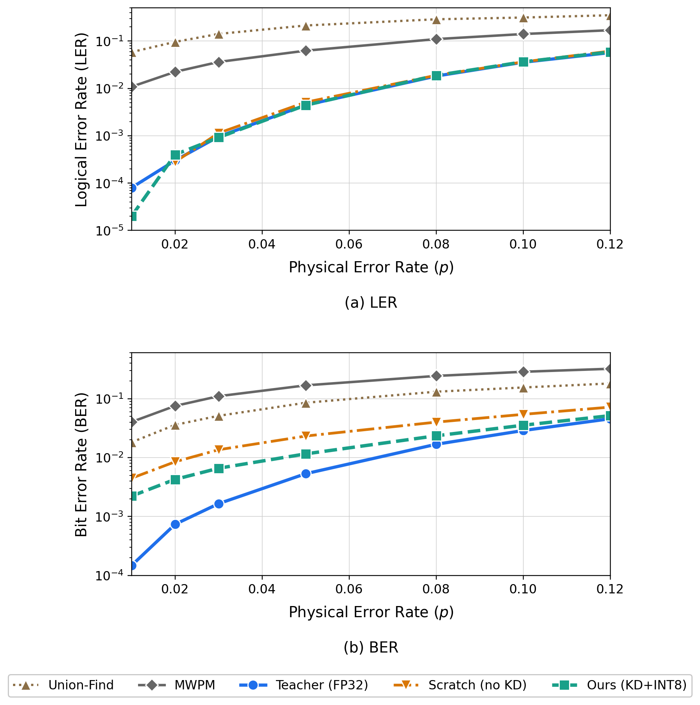
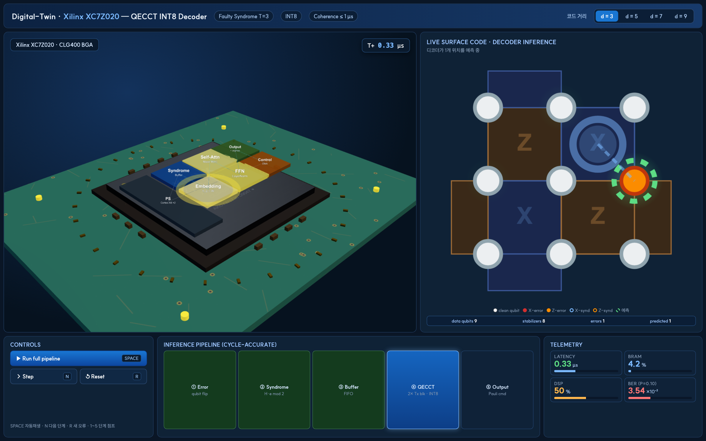
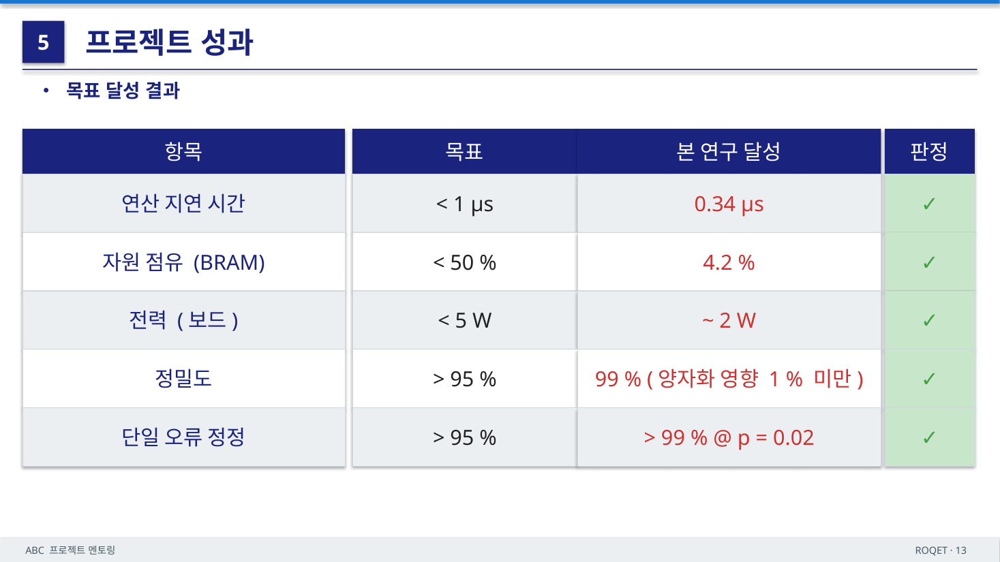

> 안녕하세요, ABC 프로젝트 멘토링 2기 ROQET 팀의 일곱 번째 기술노트입니다. 내일(5/18) 최종 결과물 발표회를 앞두고, 7주에 걸쳐 진행한 프로젝트의 최종 산출물을 정리했습니다. 4~6주차에는 사전 디코더 선택적 호출(dispatch gate)이라는 곁가지 실험을 다뤘지만, 이번 회차는 그 경로와 독립적으로 프로젝트의 **최종 결과물**인 *엣지 환경용 경량 QEC 디코더 파이프라인*과 이를 온칩에 올리기 위한 *SoC 설계 적합성*에 초점을 맞춥니다.

::: {.callout-tip title="이전 포스트"}
- [1주차 포스트](/posts/project-roqet-01-gnn-quantization/) — GNN과 PTQ 개념 정리
- [2주차 포스트](/posts/project-roqet-02-qec-stim-stabilizer/) — QEC 기본 동작과 Stim으로 신드롬 데이터 생성
- [3주차 포스트](/posts/project-roqet-03-detector-graph-gnn/) — Annotated Detector Graph와 GNN 디코더 첫 학습
- [4주차 포스트](/posts/project-roqet-04-edge-aware-decoder/) — 엣지 타입 분리 디코더와 MWPM 격차 측정
- [5주차 포스트](/posts/project-roqet-05-predecoder-helpfulness/) — 사전 디코더 호출의 균일 가정 검증
- [6주차 포스트](/posts/project-roqet-06-dispatch-gate/) — 선택적 호출 게이트와 분포 외 일반화
:::

---

## 1. 프로젝트 한눈에 보기

- **팀명**: ROQET (Robust On-device Quantum Electronics Technology)
- **팀원**: 박범도(팀장) · 박준성 · 장현석 · 장여진
- **주제**: 양자 오류 정정(QEC) AI 가속기를 위한 RTL 기반 SoC 설계 및 검증
- **최종 산출물**: Transformer 기반 QEC 디코더 QECCT를 Teacher로 둔 **Hybrid 지식 증류(KD) + INT8 Post-Training Quantization(PTQ) 경량화 파이프라인**과, 이를 온칩에서 동작시키기 위한 FPGA 자원 적합성 분석

핵심 메시지는 한 줄로 요약됩니다. **대규모 환경용으로 설계된 QEC 디코더를, 정확도를 거의 잃지 않고 엣지 디바이스에 올릴 수 있는 크기·속도까지 줄였다**는 것입니다.

---

## 2. 왜 온칩 디코딩인가

양자 시스템의 단일 물리 큐비트는 노이즈에 취약해 오류가 빈번하게 발생합니다. 이를 보완하기 위해 여러 물리 큐비트를 묶어 논리 큐비트를 구성하고, 큐비트를 직접 측정하면 중첩 상태가 붕괴되므로 패리티 기반의 **신드롬(syndrome) 측정**으로 오류 여부만 읽어냅니다. QEC 디코더는 이 신드롬으로부터 오류 위치를 추정하는데, 이 과정은 초전도 큐비트의 양자 상태가 붕괴되기 전, 즉 **코히런스 시간 1 µs 이내**에 끝나야 합니다.

문제는 지연 시간입니다. 신드롬을 외부 서버로 보내 정정하면 왕복 지연이 10~100 µs 수준으로, 코히런스 한도를 가볍게 초과합니다. 결국 **칩 안에서 직접 정정(On-Chip)** 하는 길밖에 없고, 이는 디코더가 자원이 제한된 엣지 환경에서 1 µs 안에 추론을 마쳐야 한다는 제약으로 이어집니다. 대부분의 고성능 디코더는 대규모 하드웨어를 가정해 설계되어 있어 이 제약과 충돌합니다.

| 디코딩 위치 | 정정 경로 | 지연 시간 |
|---|---|---|
| 외부 서버 전송 | 칩 → 서버 → 칩 | 10 ~ 100 µs (코히런스 한도 초과) |
| **온칩 (본 프로젝트)** | 칩 내부에서 직접 정정 | **0.34 µs (한도 내 완료)** |

---

## 3. 베이스 모델 — QECCT

배경 부호로는 평면 격자 위에서 국소 측정만으로 오류를 검출할 수 있는 **Surface Code**를 사용합니다. 격자 길이 $a$에 대해 물리 큐비트 $n = a^2$, 측정기 $n_s = a^2 - k$를 두어 $k$개의 논리 큐비트를 보호합니다.

디코더의 베이스 모델은 위상적 상관 관계를 모델 구조에 반영해 MWPM을 상회하는 LER을 보고한 Transformer 기반 디코더 **QECCT(Quantum Error Correction Code Transformer)**입니다. QECCT는 크게 세 단계로 동작합니다.

1. **초기 추정 및 임베딩** — 신드롬 $s$는 축퇴성이 있어 단독 입력 시 추론 부담이 큽니다. 노이즈 추정기 $g_\omega(\cdot)$로 큐비트 초기값을 만들어 $s$와 결합한 합성 시퀀스를 학습 가능한 임베딩 행렬과 Hadamard 연산으로 벡터화합니다.
2. **Masked Self-Attention Transformer** — 패리티 체크 행렬 $H$로부터 유도된 마스크 $M(H)$를 어텐션에 더해, 인접하지 않은 큐비트–측정기 쌍의 가중치를 차단합니다. 각 토큰은 인접 토큰의 정보만 흡수하며 $N$개 블록에 걸쳐 누적됩니다.
3. **큐비트 오류 위치 출력** — 최종 은닉 상태를 두 FC 층과 Sigmoid를 거쳐 큐비트별 오류 확률 $\hat{\epsilon} \in [0,1]^n$으로 환원합니다.

이 QECCT가 강력하지만 무겁기 때문에, 그대로는 엣지에 올릴 수 없습니다.

---

## 4. 제안 방법 — Hybrid KD + INT8 PTQ

경량화 파이프라인은 두 단계로 구성됩니다.

### 4.1 Hybrid 지식 증류

Student는 Teacher와 동일한 구조를 유지하되 블록 수 $N$, 임베딩 차원 $d_{model}$, head 수를 줄인 축소판입니다. 전체 손실은 세 항의 가중합입니다.

$$L_{Total} = \alpha_{task} \cdot L_{Task} + \alpha_{re} \cdot L_{re} + \alpha_{attn} \cdot L_{attn}$$

- $L_{Task}$ — 정답에 정합되도록 유도하는 항으로, BER·노이즈 추정기·LER 손실의 가중합입니다. LER 손실은 논리 연산자에 미분 가능 근사 함수를 적용합니다.
- $L_{re}$ — **응답 기반 KD**. Teacher와 Student 출력은 각각 독립적인 이진 분류라 KL 대신 온도 $\tau$로 평탄화한 logit에 MSE를 적용하고, 그래디언트 감쇠를 $\tau^2$ 계수로 보정합니다.
- $L_{attn}$ — **특징 기반 KD**. Teacher의 마지막 블록들과 Student 블록을 1:1로 대응시키고, 차원 불일치는 학습 가능한 선형 프로젝션 $\mathcal{P}$로 맞춥니다. 채널 제곱 평균과 L2 정규화로 추출한 어텐션 맵을 MSE로 정렬합니다.

학습 초기에는 Student가 Teacher의 표현 공간으로 수렴하기 어려운데, 응답 기반과 특징 기반 KD를 결합한 Hybrid 구성으로 이 한계를 보완합니다. 실제 학습 곡선에서 $L_{Task}$·$L_{re}$는 초기에 빠르게 수렴하는 반면, $L_{attn}$은 전 과정에 걸쳐 두 모델의 표현 공간을 미세 정렬하며 다른 수렴 양상을 보였습니다.

### 4.2 INT8 PTQ

KD로 구조를 줄인 Student의 가중치는 여전히 FP32 실수입니다. 부동소수점 연산이 제한되고 코히런스 시간 안에 추론을 끝내야 하는 엣지 환경에서는 정수 연산이 사실상 필수입니다. 그래서 학습이 끝난 Student에 INT8 PTQ를 적용합니다.

```text
Algorithm 1  INT8 PTQ
Require: 사전 학습된 Student 모델 S
Ensure : 양자화된 모델 S_q
 1: S_q ← deepcopy(S).eval()
 2: for all 학습 가능한 파라미터 텐서 θ ∈ S_q do
 3:     Δ ← max(|θ|) / 127
 4:     if Δ > 0 then
 5:         θ_q ← round(θ / Δ)
 6:         θ_q ← clamp(θ_q, -128, 127)
 7:     end if
 8: end for
 9: return S_q
```

가중치 분포가 INT8 격자 전체에 펼쳐지도록 스케일 팩터 $\Delta = \max(|\theta|)/127$를 정의하고, 오버플로우를 막기 위해 정수 범위로 clamp합니다. 검증은 PyTorch Eager Mode의 Fake Quantization으로 수행해 실제 INT8 하드웨어 추론과 수치적으로 근사한 LER·BER을 얻습니다.

---

## 5. 실험 설정

Syndrome 측정 자체에 오류가 섞이는 **Faulty Syndrome**을 가정하고, 다음과 같이 설정했습니다.

| 파라미터 | 값 |
|---|---|
| $a, n, n_s, k$ | 3, 9, 8, 1 |
| 측정 라운드 $T$ | 3 |
| 노이즈 모델 | Independent bit-flip ($p_{syn} = p_{큐비트}$) |
| $p_{train}$ | [0.005, 0.15] |
| $p_{test}$ | {0.01, 0.02, 0.03, 0.05, 0.08, 0.10, 0.12} |
| 샘플 수 | 50,000 / $p$ |
| Teacher 구조 | $N_T = 6$, $d_T = 128$, 8 heads |
| Student 구조 | $N_{stu} = 2$, $d_{stu} = 32$, 4 heads |
| $\alpha_{task}, \alpha_{re}, \alpha_{attn}$ | 0.5, 0.3, 0.2 |
| $\lambda_b, \lambda_l, \lambda_g$ | 0.5, 0.5, 1.0 |
| 온도 $\tau$ | 3.0 |

17개 공간 토큰 그래프의 직경은 3 hop입니다. Teacher는 pooling 전후 각 3블록으로 격자 전체를 훑는 반면, Student는 각 1 hop의 국소 통합만 수행하는 최소 규모이며 부족한 context를 Hybrid KD로 메웁니다.

---

## 6. 결과

### 6.1 오류율 — LER / BER

$p_{test} = 0.12$ 기준 핵심 결과입니다.

| 디코더 | LER | BER | 비고 |
|---|---|---|---|
| 전통 알고리즘 (Union-Find · MWPM) | 7.0% | 7.20% | 특정 노이즈 모델 가정 |
| **Ours (KD + INT8 PTQ, 26.7 KB)** | **≈ 0.9%** | **3.54%** | 경량화 후에도 우위 |

경량화한 Ours가 LER·BER 모두 전통 알고리즘 기반 디코더를 앞섭니다. LER은 Teacher와 0.001 미만의 오차로 근접했고, BER도 약 0.01 차이로 유지됐습니다. KD 없이 동일 구조로 학습한 Scratch는 LER 축퇴성 때문에 LER만 비슷해 보일 뿐, BER에서 Ours보다 약 0.02 뒤처져 Student가 KD로 Teacher의 어텐션을 효과적으로 흡수했음을 보여줍니다.

{#fig-ler-ber width=70%}

### 6.2 경량화 단계별 자원 절감

| 구분 | QECCT(Teacher) | KD(Only) | **Ours** |
|---|---|---|---|
| 가중치 정밀도 | FP32 | FP32 | **INT8** |
| 파라미터 수 (K) | 1,193 | 26.7 | **26.7** |
| 모델 크기 (KB) | 4,772 | 106.8 | **26.7** |
| 추론 시간 (µs) | 13.52 | 0.68 | **0.34** |

KD만으로 파라미터를 약 97.8% 줄이고, INT8 양자화로 모델 크기를 KD 단독 대비 추가로 1/4 수준까지 압축해 **최종 26.7 KB**(Teacher 대비 약 99.4% 절감)에 도달했습니다. 추론 시간은 Teacher의 13.52 µs에서 0.34 µs로 97.5% 단축되어, 코히런스 1 µs 한도 대비 약 0.66 µs의 여유를 확보했습니다.

### 6.3 FPGA 자원 적합성 — Zynq-7020

26.7 KB·0.34 µs라는 수치가 실제 보드에 올라갈 수 있는지 점검했습니다. 선정 보드는 **Xilinx XC7Z020 (PYNQ-Z2)**입니다.

| 요구 사항 | 근거 | Zynq-7020 제공 |
|---|---|---|
| INT8 MAC 병렬화 | Masked Self-Attention의 Q·K·V 곱 + Softmax | DSP48 슬라이스 220 |
| 가중치 온칩 상주 | 26.7 KB 모델 전체를 외부 RAM 없이 | Block RAM 630 KB |
| 신드롬 I/O · 제어 | 측정 데이터 수신 · 정정 명령 송출 | ARM Cortex-A9 ×2 |
| 엣지 저전력 동작 | 냉각 인접 배치 가능한 무팬 보드 | ≈ 2 W (팬리스), 85K LUT, USD 249 |

모델이 BRAM 안에 통째로 들어가고, DSP 슬라이스로 INT8 MAC를 병렬 처리하며, ARM 코어가 신드롬 I/O와 제어를 맡는 구성으로 온칩 디코딩 SoC의 자원 요건이 충족됨을 확인했습니다.

### 6.4 Digital Twin 데모 · 목표 달성

소프트웨어 Digital-Twin 환경에서 신드롬 입력 → 디코더 추론 → 오류 정정의 전 과정을 재현해, 위 수치가 단일 지표가 아니라 디코딩 파이프라인 전체에서 일관되게 성립함을 시연했습니다.

{#fig-digitaltwin width=90%}

프로젝트 초기 목표였던 *코히런스 시간 내 온칩 추론*, *엣지 자원 내 상주*, *전통 알고리즘 대비 정확도 우위*를 모두 달성했습니다.

{#fig-goal width=90%}

---

## 7. 결론 및 한계, 향후 계획

대규모 환경용 QEC 디코더 QECCT를 Teacher로 두고 Hybrid KD와 INT8 PTQ를 결합해, **모델 크기 99.4%·추론 시간 97.5%를 절감하면서 LER 0.001 미만·BER 약 0.01 수준의 차이로 디코딩 성능을 유지**했습니다. KD를 통한 표현 공간 전이와 PTQ를 통한 가중치 축소가 상보적으로 작동할 때, 정확도를 지킨 채 경량화가 가능함을 확인한 것이 핵심 성과입니다.

한계도 분명합니다. 실험 격자 길이가 $a=3$이라 격자 확장에 따른 어텐션 마스크 희소도 변화와 KD 전이 효율의 일반화 검증이 부족하고, 결과가 소프트웨어 시뮬레이션이라는 점도 남는 과제입니다. 향후에는 $a \ge 5$ 격자에서 FPGA에 직접 합성·실장해 실측 검증을 수행할 계획입니다.

::: {.callout-note title="결과물 및 발표 자료"}
- 본 프로젝트의 최종 발표는 *2기 ROQET 발표자료*(QEC AI 가속기를 위한 RTL 기반 SoC 설계 및 검증)로 진행합니다.
- 경량화 파이프라인의 상세 설계는 별도 논문 *「엣지 환경에서의 QEC를 위한 Hybrid 지식 증류 기반의 PTQ 경량화 파이프라인 설계」*(장현석 · 박준성 · 박범도 · 정훈 · 허태욱 · 이상금)에 정리되어 있으며, 학회 제출은 팀원 장현석이 담당합니다.
:::

::: {.callout-tip title="참고 문헌"}
- Battistel, F. et al. (2023). *Real-time decoding for fault-tolerant quantum computing: progress, challenges and outlook.* Nano Futures.
- Fowler, A. G. et al. (2012). *Surface codes: Towards practical large-scale quantum computation.* Phys. Rev. A 86, 032324.
- Higgott, O. (2022). *PyMatching: A Python package for decoding quantum codes with minimum-weight perfect matching.* ACM Trans. Quantum Comput.
- Choukroun, Y. & Wolf, L. (2024). *Deep quantum error correction.* AAAI.
- Hinton, G. et al. (2015). *Distilling the knowledge in a neural network.* arXiv:1503.02531.
- Zagoruyko, S. & Komodakis, N. (2017). *Paying more attention to attention: Improving the performance of CNNs via attention transfer.* ICLR.
- Yao, Z. et al. (2022). *ZeroQuant: Efficient and affordable post-training quantization for large-scale transformers.* NeurIPS.
:::

---

7주에 걸친 ABC 프로젝트 멘토링 2기 ROQET 팀의 기술노트는 이 글로 마무리합니다. 양자 오류 정정이라는 낯선 주제에서 출발해, GNN·Stim·디텍터 그래프·사전 디코더 게이트를 거쳐, 결국 *엣지에서 1 µs 안에 도는 26.7 KB 디코더*라는 손에 잡히는 결과물까지 닿았습니다. 함께해 주신 멘토님과 팀원들께 감사드립니다.
